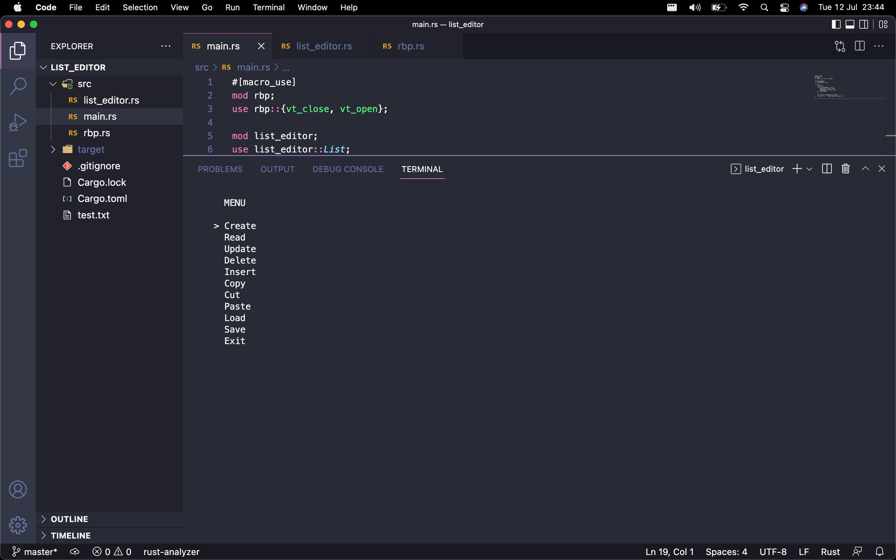

# List Editor

A command-line version of the classic todo application.

## Will not run on Windows

The ncurses crate is unix only.

## Adjustment to work properly on GNU/Linux distros

Globally substitute the ascii code '127' with the macro 'KEY_BACKSPACE'.

## Will not run in the IntelliJ terminal

Although the app can be built in IntelliJ using the Rust plugin, the finished binary should be run in a normal terminal emulator.
